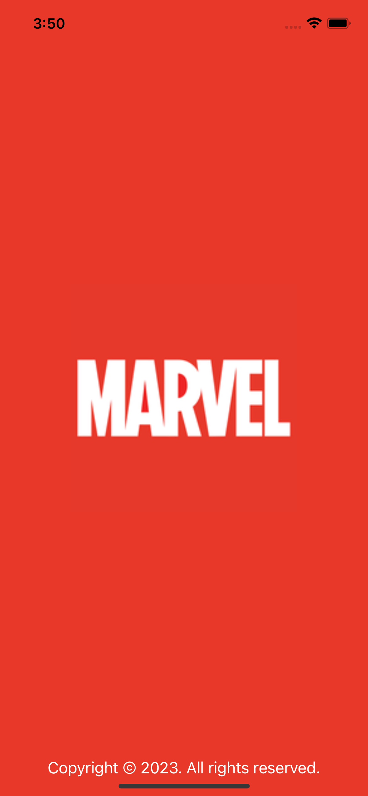
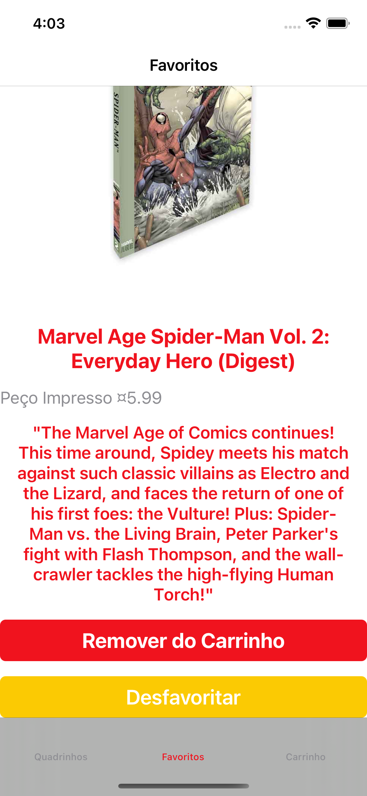
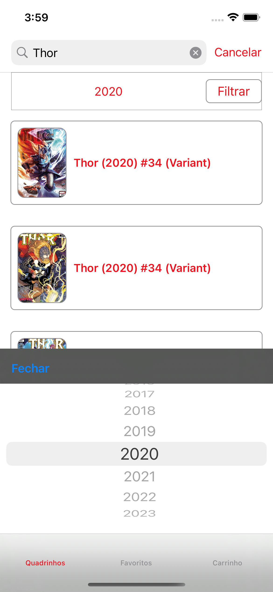

# Marvel Store

Projeto simples para consumir a API da Marvel, e exibir algum conteúdo sobre as revistas em quadrinhos.

## <b> <span style="color:red"> LEIA AQUI! </span> </b>
Por questões de segurança as chaves da API não estão no projeto. 
Para excutar a build no scheme de producao, será necessário providenciar a `PRIVATE_KEY` e `PUBLIC_KEY`, de acesso da API da Marvel.

Para exicutar o projeto em `desenvolvimento` será necessário criar um arquivo plist novo, e incluir suas chavez la. 

 Mais informações podem ser vistas nesse README: [LINK AQUI!](app/supportfiles/plists/)

### Preview

#### Light Mode
<p float="left">
<kbd></kbd>
<kbd></kbd>
<kbd></kbd>
<kbd></kbd>
<kbd></kbd>
<kbd></kbd>

#### Dark Mode
<p float="left">
<kbd></kbd>
<kbd></kbd>
<kbd></kbd>
<kbd></kbd>
<kbd></kbd>
<kbd></kbd>
</p>

## Sobre o projeto: <br>
- Xcode Version 14.3 ou superior<br>
- Suporte mínimo ao iOS 13<br>
- Swift 5<br>
- Cover Coverage habilitado


## Features exploradas
- Tratamento de erros
- CodeView
- Aplicação de Testes Unitários
- Swiftlint
- Aplicado MVVM-C
- DarkMode

## Preparando o Ambiente
Para executar o projeto, siga os passos abaixo.

#### Ferramentas de Gestão e Qualidade de Código<br>
- Fastlane
- Slather
- Jazzy
- Swiftlint

#### Gerenciador de Dependências<br>

Gerenciadores usados: 
 - Swift Package Manager

Dependências:
- [Kingfisher](https://github.com/onevcat/Kingfisher): Download assincrono e cache de imagens.
- [Alamofire](https://github.com/Alamofire/Alamofire): Requisição de dados fornecidas por API.
- [Realm Swift](https://github.com/realm/realm-swift.git): Armazenamento local de dados.

## Instruções para Execução de Projeto

Foi utilizado a versão do Ruby 2.7.0 no uso das ferramentas de gestão e qualidade.

---

## Configurando o Projeto

### [RVM](https://rvm.io/) e [BREW](https://brew.sh/)

Instale o RVM com o seguinte comando: <br>

```\curl -sSL https://get.rvm.io | bash -s stable```

Após a instalação, utilize o seguinte comando para usar a versão 2.7.0 do Ruby:

```
rvm install 2.7.0
```

Depois use o comando: <br>
```
rvm use 2.7.0
```

Instale o brew com o seguinte comando: <br>

```
/usr/bin/ruby -e "$(curl -fsSL https://raw.githubusercontent.com/Homebrew/install/master/install)"
```

---
### Instalando dependencias de Gestão

Após instalados o RVM com a versão indicada do Ruby, e a instalação do Brew, execute os seguintes comandos

```brew bundle```

Irá instalar as dependencias listadas no arquivo `Brewfile`.

Após a conclusão das instalaçoes feitas com brew, execute o comando a baixo para instalar as dependencias do Gemfile:

```bundle install```

---

### Instalação de Dependências do Projeto

No Xcode atualize as dependencias usando o Swift Package Manager

## Ferramentas

### Fastlane

Usado para automatizar tarefas como execucao de testes unitários, assinatura projetos e envio para Loja e Testflight.

No projeto, já possi alguns lanes básicos configurados. Para usa-los, execute um dos comandos abaixo:

- Check code style<br>
```fastlane ios lint_code```

- Create coverage report<br>
```fastlane ios coverage```

- Used by Development to keep code quality.<br>
```fastlane ios check_code``` ou ```fastlane check_code dev:true```

Ver mais no link: [Fastlane](https://fastlane.tools)

### Jazzy

Ferramenta para documentação de código

Ver mais no link: [Realm/jazzy](https://github.com/realm/jazzy)

### Slather

Ferramenta para exibir de forma mais amigável informações de cobertura de código do projeto.

Ver mais no link: [Slather](https://github.com/SlatherOrg/slather)

--- 
### Autor

Tiago Amaral iOS Developer.
<br>
- [Linkedin](https://www.linkedin.com/in/tiagoamaralios/)
